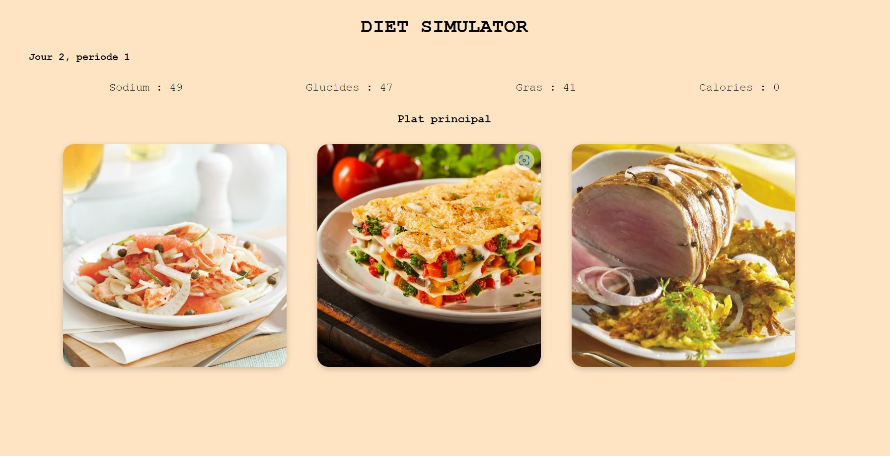

# Diet Simulator
A repository for the project of "Jeu Video 2D" course by Chloe Luthier and Jason Ola for Prof. Isaac Pante (SLI, Lettres, UNIL).

## Description
This project aims to create a video game that raise awareness of peolple's consumption of food by paying attention to the nutritional values. To do so we extracted data from ["Quatre semaines de menus santé"](https://wrha.mb.ca/files/nutrition-healthy-menu-f.pdf) in order to make this [spreadsheet](https://docs.google.com/spreadsheets/d/1kW1L8sYYg5gtBqkpGsvch-RwpNPpQcXEQ7qy9J9Ioq0/edit#gid=0) with the extracted data. In the spreadsheet we also injected the points based on the average quantity of each element that we should ingest each day, the value of the average quantity being found in those articles: [Dietary reference values for sodium](https://doi.org/10.2903/j.efsa.2019.5778), [Les graisses dans la nutrition](https://www.blv.admin.ch/dam/blv/fr/dokumente/das-blv/organisation/kommissionen/eek/fette-in-der-ernaehrung-2013/empfehlung-fette-ernaehrung.pdf.download.pdf/3_EEK_Revision+Fettempfehlungen+2012_FINAL_F.pdf), [Recommandations concernant les glucides](https://www.blv.admin.ch/dam/blv/fr/dokumente/lebensmittel-und-ernaehrung/ernaehrung/empfehlungen-kohlenhydrate.pdf.download.pdf/recommandations-glucides.pdf). You must chose your menu three times a day, and after some time, if your meals are not balanced enough you will lose! 

### Rules
Stay below 80 and above 20 in the 3 metrics. Calories is just for information to understand what it takes to get to regular 2000 Cal per day.

So start the game and chose wisely !

## Usage
To run the project, open the folder in VS Code and go live with Live Server extension.
To play the game click [here](https://diet-simulator.vercel.app/)

## Programming languages
This project has been made using HTML and Javascripz.

## Contributing
Pull requests are welcome. All optimisations of the code are welcome.